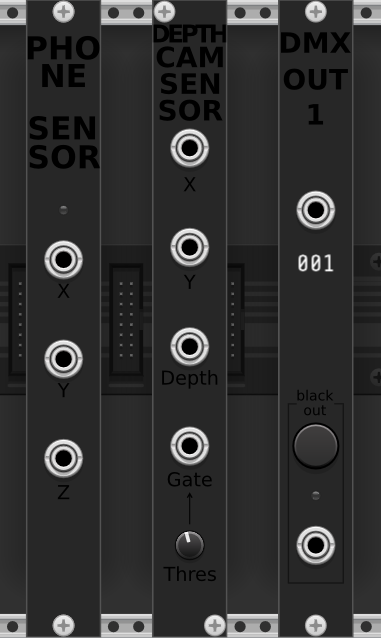

# QualiaTouch - a VCV Rack 2 plugin

## About

QualiaTouch is about giving the machine perception and action capabilities with the outside world.

## PhoneSensor module

- PhoneSensor module : retrieves sensor data from the Phyphox app. Not affiliated with PhyPhox, just using their awesome app. Documentation [here](doc/phonesensor.md).

## KinectSensor module

- KinectSensor : retrieves hand position and depth from the Kinect sensor. This plugin is not affiliated with Kinect or Microsoft in any way. 🚧 Still experimental 🚧 Documentation [here](doc/kinect.md).

## DMX module

If you know about the DMX protocol, then you've already understood what this module does.

- DMX OUT 1 : allows to send DMX data on one channel from the computer. You'll need an USB -> DMX OUT adapter and an appropriate driver. 🚧 Still experimental 🚧 Documentation [here](doc/dmx.md).

## Contributing

Contributions are much welcome! Especially from C++ experienced people, who'll know how to optimize the execution, clean the code, make it portable and most importantly, prevent memory leaks. Also from svg-friendly people, to improve the module widgets.

## Thanks

The peole who coded the drivers, the libraries, and the Phyphox app, deserve praise for facilitating the work of many people.
