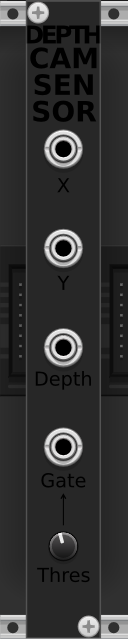

# DepthCamSensor module

The Kinect sensor device has been used for many uses, further than just a gaming console accessory, especially in robotics.

I wanted to allow people to get body movement as input signal into VCV Rack. For instance, controlling pitch and volume with the hands, like with a theremin.

So i got my Kinect out from a drawer (because that's what i have) and started a VCV Rack module with the freenect lib.

## Important

🚧 This module is still experimental and a work-in-progress. 🚧

For now, the module only supports the use of one Kinect sensor at a time. Also, there should be only one instance of this module placed on the rack. The use of several DepthCamSensor modules can lead to unwanted behavior.

Currently, the resulting signal is jittery and glitching, it needs further refining and corrections to be made smoother.

The Kinect device must be plugged into the computer before starting VCV Rack ; and it shouldn't be unplugged until you remove the DepthCamSensor module from the rack or close VCV Rack.

## Requirements

Of course, the module requires a Kinect device to be connected to the PC.

You cannot connect the Kinect device to the PC directly, because it uses a specific proprietary connector (USB with an additional power pin for the motor), forbidding to plug it in a normal usb port. You'll either want to take the Kinect apart to rewire it to a generic USB plug (there are tutorials on the web for that), or to simply buy an appropriate adapter (it plugs to the proprietary connector, and to a power socket).

## The DepthCamSensor module

## Outputs

The module has 4 outputs.

  - The first two (X and Y) output a 0-10V CV signal corresponding to the X and Y position of the closest object (usually, you'll use one hand in front of you).
  - The third output is the depth of the closest object.
  - The fourth one is a gate that outputs either 10V or 0V, depending on wether the depth of the closest object is closer or further than a defined threshold.

## Threshold parameter

A knob allows you to change the threshold value.

The threshold has an hysteresis band of 50mm to avoid flickering when your hand is close to the threshold.

## Sensor tilt

In the right-click menu of the module, you can select an angle value for the tilt of the Kinect sensor. It will send a command to the sensor to activate its motor and place it to the desired angle. Don't abuse of this setting because it's a physical motion that can wear out the device over time.
