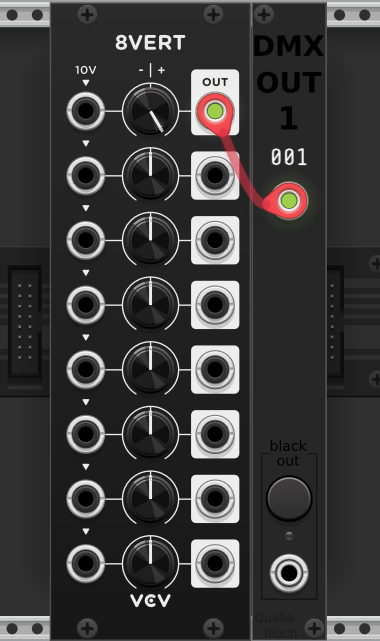

# Configuring DMX on your operating system

Depending on your OS and the DMX adapter you have, the configuration can differ. I'm showing what i've done on my computer to give you an idea of what should be done. If you have a different system and made it work, i can include your instructions here.

## Ubuntu (or derivative) with OLA + ENTTEC Open DMX USB adapter

Linux should already have the drivers for the adapter itself. What you'll need is the [OLA framework](https://www.openlighting.org/ola/) to make VCV send data to the adapter, for a given DMX universe.

### Installing

You can install the OLA framework with the software package:

````bash
$ sudo apt install ola
````

You can also compile it yourself : https://www.openlighting.org/ola/linuxinstall/. It seems to have more extensive features than the apt package, but the package should be enough for what we need.

OLA comes with commands to configure and monitor DMX and other protocols on your computer. The idea for us now is to find under which device and wich port OLA sees your USB-DMX adapter, and then patch this device/port to the DMX universe you'll use.

### Getting the device id and port id

Before plugging the adapter:

````bah
$ ola_dev_info
````

You should see something like this:

````
Device 1: Dummy Device
  port 0, OUT Dummy Port, RDM supported
Device 2: Art-Net [192.168.1.28]
  port 0, IN, priority 100, RDM supported
  [...]
Device 3: ShowNet [192.168.1.28]
  [...]
[...]
Device 7: E1.31 (DMX over ACN) [192.168.1.28]
  [...]
````

Then plug the adapter and restart olad before repeating the command:

````bah
$ sudo systemctl restart olad
$ ola_dev_info
````

You should see a new section:
````
[...]
Device 8: FT232R USB UART with serial number : BG00UZBV
  port 1, OUT FT232R USB UART with serial number : BG00UZBV
````

That gives you the device and port ids you'll patch to universe 1.

### Activating the plugin

Before patching, you'll need to check wich OLA plugins are enabled, because if the needed plugin is disabled (or conflicts with another one), nothing will work. `ola_plugin_info` will give you a list of installed OLA plugins:


````bash
$ ola_plugin_info
   Id	Plugin Name
--------------------------------------
    1	Dummy
    2	ArtNet
    3	ShowNet
    4	ESP Net
    5	Serial USB
    6	Enttec Open DMX
    7	SandNet
    8	StageProfi
    9	Pathport
   11	E1.31 (sACN)
   12	USB
   13	FTDI USB DMX
   15	SPI
   16	KiNET
   17	KarateLight
   18	Milford Instruments
   19	Renard
   20	UART native DMX
   21	Open Pixel Control
   22	GPIO
   23	SPI native DMX
   24	Nanoleaf
````

To get info on a specific plugin:
````bash
$ ola_plugin_info -p 13
````

In the case of the Enttec Open DMX USB, we need to use the _FTDI USB Chipset DMX_ plugin.

To can check the current state of the plugin:

````bash
$ ola_plugin_state -p 13
FTDI USB DMX
Enabled: True
Active: True
Conflicts with:
  Serial USB(5)
  Enttec Open DMX(6)
````

You see that plugin 13 is enabled, but it's also   in conflict with plugins 5 and 6. So we'll need to disable those two.

To disable the plugins (adapt the ids to your situation):
````
$ ola_plugin_state -p 5 -s disable
Setting state to disabled
$ ola_plugin_state -p 6 -s disable
Setting state to disabled
````

To enable the appropriate plugin, if not already enabled:
````
$ ola_plugin_state -p 13 -s enable
Setting state to enabled
````
The conflict is still there but once you deactivated the other modules, it shouln't be a problem.

### Patching the device to a universe

Now that we have enabled the appropriate OLA plugin, we can finally patch the device to the universe we want. Here's the command to patch device 8, port 1 to universe 1:

````bash
$ ola_patch -d 8 -p 1 -u 1
````

And now you should see that port 1 of device 8 is patched to universe 1:

````
$ ola_dev_info
Device 8: FT232R USB UART with serial number : BG00UZBV
  port 1, OUT FT232R USB UART with serial number : BG00UZBV , patched to universe 1
````

Don't forget: each time you re-plug the adapter, modify the configuration, or before starting VCV Rack, make sure to restart the OLA daemon:
````
$ sudo systemctl restart olad
````

Once you've done all of that, you can check that the config and patching are correct by using `ola_dmxconsole`. It's a terminal interface allowing you to manually send dmx values to a universe. For universe 1:

````bash
$ ola_dmxconsole -u 1
````

Plug a DMX fixture (ideally, one that you know well) in the USB-DMX adapter and send a value to its address from `ola_dmxconsole`. If it does nothing, there might be a problem with the configuration or patching. If it has an effect on the DMX fixture, then it should also work from VCV Rack.

### Using the DMX module

Open VCV Rack and add a DMX module, and configure it with an address and universe, following the instructions in the DMX module [documentation](dmx.md). Once you send a signal to the module's input, it should start sending it through the USB-DMX adapter.



To monitor the DMX values passed to universe 1, without sending data:

````bash
$ ola_dmxmonitor -u 1
````

### If it doesn't work

Things you could try:
- check the addresses and universe parameters, and that you're actually sending a value
- add your user to the `dialout` group (`sudo adduser <user> dialout`) especially if you use serial USB
- check with `lsusb` that your adapter is detected and recognized
- restart olad (OLA daemon) each time you change something, before starting VCV or `ola_dmxmonitor`
- turn the computer off and on again lol
- some LLM might spit out words that can somehow lead you to the start of a resemblance of a solution
- compile OLA from source instead of using the apt package
- use another OLA plugin that could be more appropriate  (`ola_plugin_info` and `ola_plugin_state`), and beware of plugin conflicts and states ; each plugin has a description to help you understand what it's for
- use another framework than OLA ?

You can also contact me at qualiatouch@proton.me, two brains might be of more help than one.

### If it works

Then you're about to expand your world and unite the infinite possibilites of a modular synth, to the physical possibility of the DMX universe!
