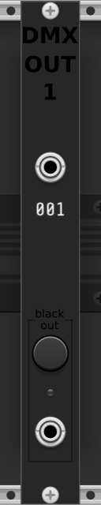
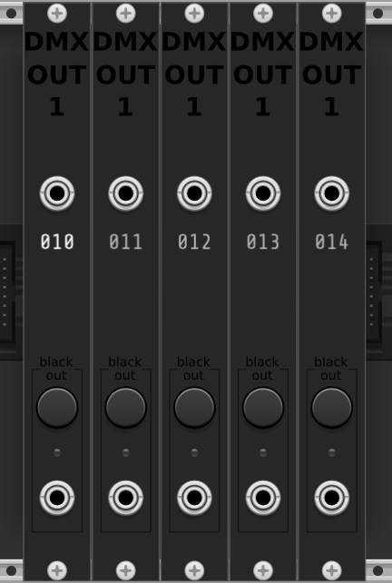
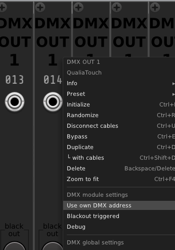
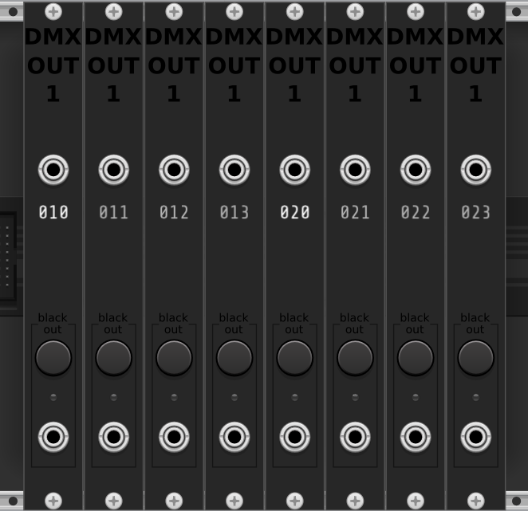
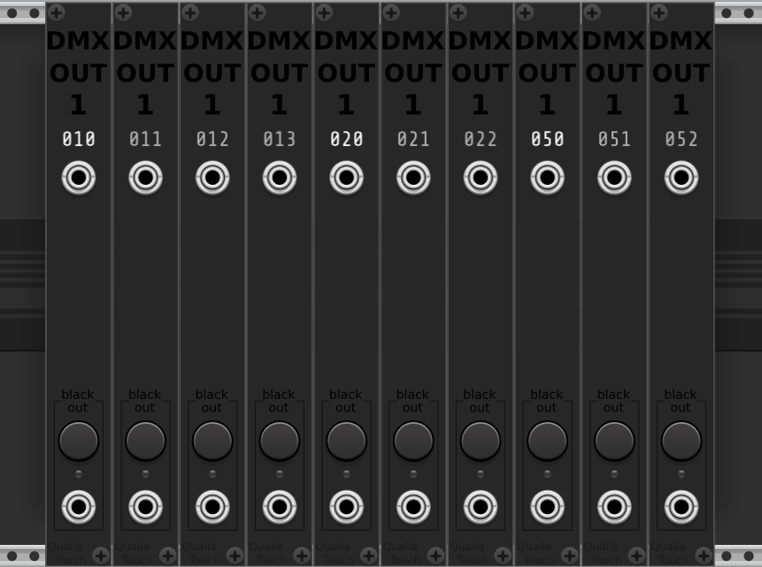

# DMX modules

The DMX modules allow you to send DMX data to lighting fixtures in real life, from signals in your modular synth patch.

## Requirements

- An USB -> DMX OUT adapter
  - I'm using the ENTTEC Open DMX USB adapter. I'm saying that only as an example of what works, I'm not affiliated with ENTTEC in any way.
- Any DMX fixture, connected to the adapter by DMX cables. I mean, that's the purpose of the module, so if you're reading this you probably have at least one lighting fixture laying around somewhere in your field of view right now, and which you want to be controlled.
- The drivers / framework that are supposed to work with your adapter.
  - I'm using [OLA](https://www.openlighting.org/ola/) (Open Lighting Architecture) on Linux.
- Some hope that your computer will allow you to make it all work.

## Starting

The DMX adapter should be plugged in, and the OLA framework running, before starting VCV Rack.

## Basics

Start with one DMX module. It has an input port and a blackout button.

You can configure the DMX address of the module by right-clicking it and modifying the "DMX Address" field.

You can also select the DMX universe you want the data to be sent to. For now, all DMX modules on the rack will send data to the same DMX universe.

The module will:
  - take a 0-10V CV signal as an input
  - transform it to a value between 0 and 255
  - emit a DMX signal of 256 channels through the adapter to the fixtures that are connected to it
  - the selected address with contain the calculated value, the rest of the channels will have the value 0.

The module displays its DMX channel under the value input.

## Chaining modules

One handy thing with the DMX protocol is that lighting fixtures often use several consecutive channels, starting at their assigned DMX address, to control separate parameters of the same fixture. The DMX module is conceived for that use and allows you to send values to consecutive DMX channels, by chaining several modules together:

The base address will be the address assigned to the first (leftmost) module. Each additional module (directly on the right and touching) will have a channel of +1 relative to the previous module.

If you want a module to have its own DMX address (i.e. different than incrementing the previous one) while still being right aside another DMX module, you can check the "Use own DMX address" option in its menu, and assign an address to it. The modules on the right side of this module will follow its address incrementally.

Each module displays the DMX channel it's sending data to ; if the module uses its own address (not depending on the other modules), the address display is emphasized.

## Blackout

On each module there is a blackout button, and a blackout input. When the blackout button is pushed (or when the blackout input receives a gate or trigger signal), the module sends a blackout signal (0 on every channel) through the DMX adapter, and puts the module in "blackout triggered" state. In that state, a red LED lights up on the module.

When a blackout has been triggered on a module, it stays in the "blackout triggered" state, and it prevents sending any other signal to the DMX adapter. If several modules are chained, none of them will send data.

When you've put the signals in an acceptable state and are ready to start again, just uncheck the "Blackout triggered" item in the right-click menu.

## Why a DMX module for VCV Rack?

A bunch of rich and complex computer software already exist for commanding DMX lighting. It can be synchronized with music and programmed to do basically anything. I'm not inventing anything actually new here.

What i wanted to do is giving a way for people to command DMX lighting specifically from a modular synthetizer software. People who create music via modular synth deserve to be able to synchronize their lighting system too.

## Show your work!

If you use those modules, and doing a lightshow commanded by VCV, please send me a video of what you've realized (qualiatouch@proton.me), i'm eager to see what people will do with them!

