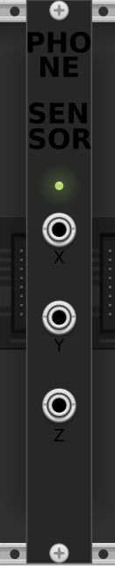

# PhoneSensor module

## About

This module connects to the [PhyPhox](https://phyphox.org/) app on a smartphone and produces outputs with the values measured by the sensors of the smartphone. The plugin is not affiliated with PhyPhox.

## Requirements

- A smartphone
    - with sensors
    - with the PhyPhox app installed
    - on the same network as the computer VCV Rack runs on. Typically, you want the computer and the smartphone to be connected to the same Wi-Fi network.

## Supported sensors

The PhyPhox app uses the sensors available in the smartphone it's installed on. The PhoneSensor module currently supports those types of sensors:
- magnetic (mag)
- acceleration (acc)
- light (illum)
- orientation (tilt)
- sound (dB)
- color (hsv)
- gyroscope (gyr)

You can request support of another sensor type at qualiatouch@proton.me.

## Instructions

1. On the smartphone, open the PhyPhox app, select a sensor (among supported sensors of course), and in the top-right menu, select the option to allow remote control. This will open a webserver in the app, accessible from the local network, and the app will display the ip and port of the webserver. This will make the data available from the PhoneSensor module.
2. Select the same type of sensor in the parameters (right-click menu) of the PhoneSensor module.
3. Set the ip/port in the parameters of the module.
4. Use the X/Y/Z outputs of the module to command everything you want.

## Parameters

- Voltage mode : unipolar/bipolar. Sets the module to output either a `0V -> +10V` or a `-5V -> +5V` voltage signal.

## Led colors

A LED indicates the status of the module :

- red : error - the smartphone is not reachable, or the data is invalid
- orange : we're connected to the PhyPhox app, but the app is not measuring
- green : we're connected to the PhyPhox app and receiving data measured by the sensor

## Sensor values to output mapping

The CV signals coming out of the three outputs X, Y and Z will correspond to different sensor dimensions, depending on the selected sensor:

| Sensor type (unit)  | X output | Y output | Z output |
|---------------------|----------|----------|----------|
| Magnetic (µT)       | X axis   | Y axis   | Z axis   |
| Acceleration (m/s²) | X axis   | Y axis   | Z axis   |
| Light (lx)          | intensity| nothing  | nothing  |
| Tilt (°)            | up-down  |left-right| nothing  |
| Sound intensity (dB)| X axis   | nothing  | nothing  |
| Color (0-255)       | Red      | Green    | Blue     |
| Gyroscope (rad/s)   | X axis   | Y axis   | Z axis   |

## Good to know

The module parameters are saved in the patch file, so they'll be the same when you close and open it again.

Switching sensor type might not work immediately. You might need to save the patch, close and re-open vcv rack, so that the newly selected sensor is taken into account.

The PhyPhox app doesn't allow to use more than one sensor at the same time. However, if you have several devices with the app installed, you can place several PhoneSensor modules on the same rack, each one connected to a different device.
